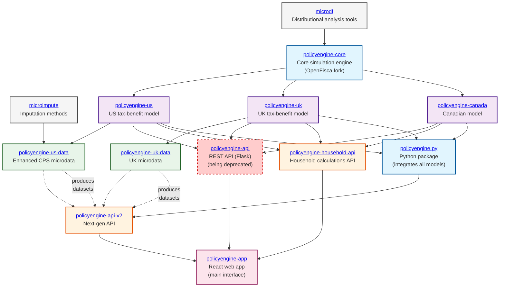
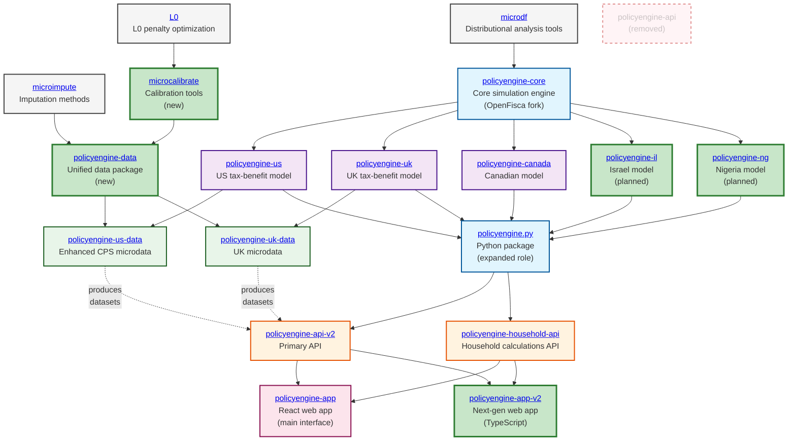

# PolicyEngine Tech Stack Architecture

## Current State Architecture

## Future State Architecture

## Key Architecture Changes

### Current → Future State Transitions

#### 🔴 **Deprecations**
- **policyengine-api**: Legacy Flask API being phased out
- Direct country model → API connections being replaced by policyengine.py integration

#### 🟢 **New Components**
- **policyengine-data**: Unified data package consolidating country-specific data generation
- **microcalibrate**: Dedicated calibration tools (fed by L0 optimization)
- **policyengine-il**: Israel tax-benefit model
- **policyengine-ng**: Nigeria tax-benefit model
- **policyengine-app-v2**: TypeScript-based next-generation web application

#### 🔄 **Enhanced Roles**
- **policyengine.py**: Becomes the primary integration point, feeding household-api in addition to api-v2
- **policyengine-data**: Centralizes data generation logic currently spread across country-specific repos

## Repository Directory

### Core Infrastructure
- [policyengine-core](https://github.com/PolicyEngine/policyengine-core) - Core simulation engine
- [policyengine.py](https://github.com/PolicyEngine/policyengine.py) - Python package integrating all models

### Country Models
- [policyengine-us](https://github.com/PolicyEngine/policyengine-us) - US federal and state model
- [policyengine-uk](https://github.com/PolicyEngine/policyengine-uk) - UK tax-benefit model
- [policyengine-canada](https://github.com/PolicyEngine/policyengine-canada) - Canadian model (early stage)

### Data & Analytics
- [policyengine-us-data](https://github.com/PolicyEngine/policyengine-us-data) - US microdata generation
- [policyengine-uk-data](https://github.com/PolicyEngine/policyengine-uk-data) - UK microdata generation
- [microdf](https://github.com/PolicyEngine/microdf) - Distributional analysis tools
- [microimpute](https://github.com/PolicyEngine/microimpute) - Imputation methods
- [survey-enhance](https://github.com/PolicyEngine/survey-enhance) - Survey data calibration
- [L0](https://github.com/PolicyEngine/L0) - L0 penalty optimization

### APIs
- [policyengine-api](https://github.com/PolicyEngine/policyengine-api) - Legacy REST API (being deprecated)
- [policyengine-api-v2](https://github.com/PolicyEngine/policyengine-api-v2) - Next-generation API
- [policyengine-household-api](https://github.com/PolicyEngine/policyengine-household-api) - Household-level calculations

### Applications
- [policyengine-app](https://github.com/PolicyEngine/policyengine-app) - Main React web application
- [policyengine-app-v2](https://github.com/PolicyEngine/policyengine-app-v2) - TypeScript next-gen app

### Specialized Tools
- [finsim](https://github.com/PolicyEngine/finsim) - Retirement portfolio simulation
- [mortality](https://github.com/PolicyEngine/mortality) - Mortality calculations

## Technical Notes

### Data Flow
1. **Microdata Generation**: Raw survey data → enhancement/imputation → calibrated microdata
2. **Model Execution**: Parameters + variables + microdata → simulation results
3. **API Processing**: Country models + datasets → cached calculations → client responses
4. **Visualization**: API results → React components → interactive charts

### Technology Stack
- **Backend**: Python (OpenFisca framework, Flask/FastAPI)
- **Frontend**: React (JavaScript/TypeScript), Plotly.js
- **Infrastructure**: Google Cloud Platform (App Engine, Cloud SQL, Cloud Build)
- **Data Processing**: NumPy, Pandas, microdf
- **Caching**: Redis
- **CI/CD**: GitHub Actions, Google Cloud Build

### Deployment Architecture
- **Production**: Google App Engine (auto-scaling)
- **Database**: PostgreSQL (Cloud SQL)
- **Caching**: Redis for computation results
- **CDN**: Static assets served via CDN
- **Monitoring**: Google Cloud Monitoring, custom metrics